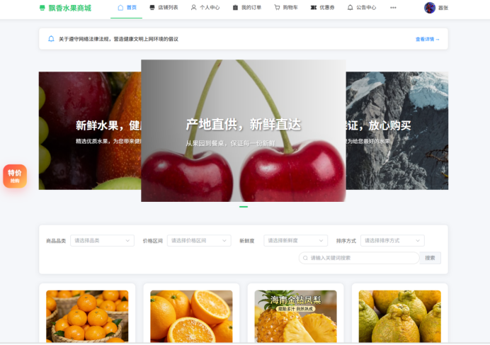
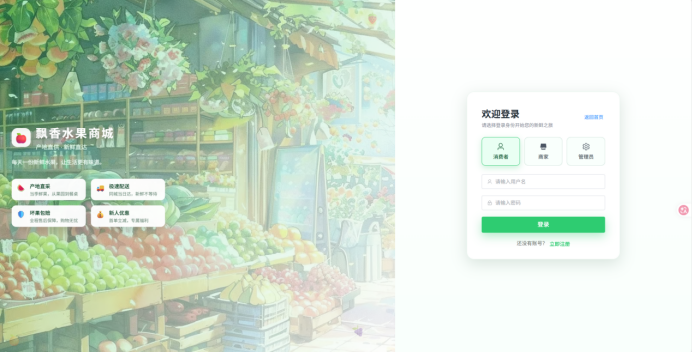
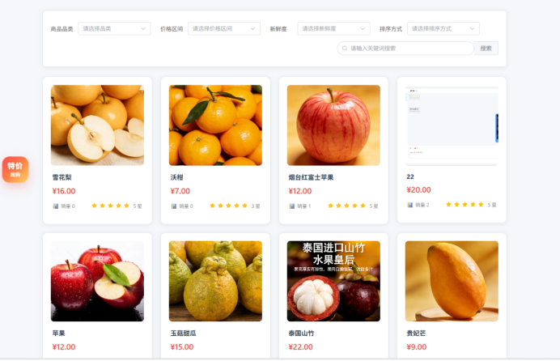
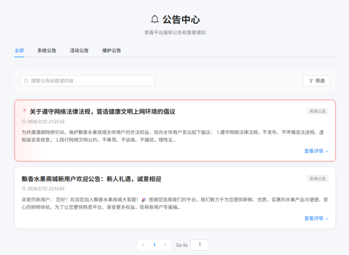
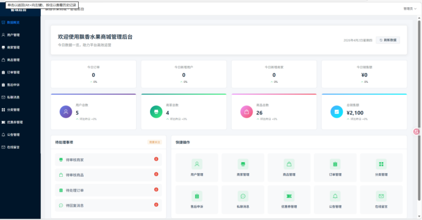
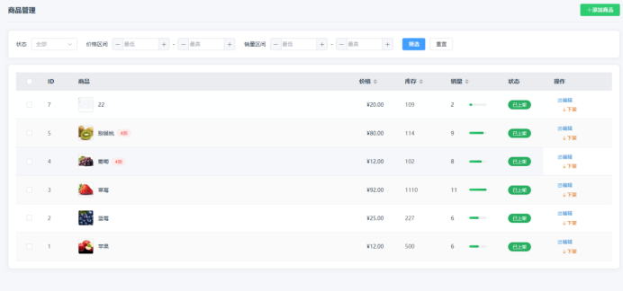
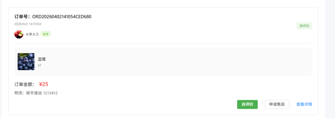
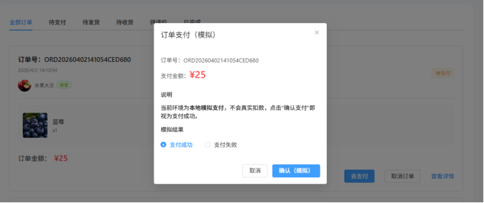

<p align="center">
  <h1 align="center">🍊 飘香水果商城</h1>
  <p align="center"><strong>Spring Boot + Vue3 全栈水果电商平台</strong></p>
</p>

<p align="center">
  
</p>

---

## 📖 项目简介

飘香水果商城是一个全栈水果电商平台，涵盖**消费者端**、**商家端**、**管理端**三个子系统，支持商品浏览、购物车、在线聊天、优惠券、售后服务、支付宝模拟支付等功能。

> 本项目为计算机相关专业毕业设计作品。

---

## 🛠 技术栈

| 层级 | 技术 | 版本 |
|------|------|------|
| 后端框架 | Spring Boot | 2.7.14 |
| ORM | MyBatis-Plus | 3.5.3.1 |
| 鉴权 | JWT (jjwt) | 0.11.5 |
| 数据库 | MySQL | 8.0 |
| 前端框架 | Vue 3 | 3.3.4 |
| 构建工具 | Vite | 5.0.8 |
| UI 组件库 | Element Plus | 2.4.2 |
| 状态管理 | Pinia | 2.1.7 |
| 图表 | ECharts | 6.0.0 |

---

## 📐 系统架构

```
┌─────────────────────────────────────────────┐
│               前端 (Vue3 + Vite)              │
│    消费者端        商家端        管理端        │
└──────────────────┬──────────────────────────┘
                   │ HTTP /api
┌──────────────────▼──────────────────────────┐
│           后端 (Spring Boot 2.7)             │
│   Controller → Service → Mapper → MySQL      │
│              JWT 鉴权 + 支付宝SDK             │
└──────────────────┬──────────────────────────┘
                   │
┌──────────────────▼──────────────────────────┐
│              MySQL 8.0 数据库                 │
│              库名: fruit_shop                 │
└─────────────────────────────────────────────┘
```

---

## ✨ 功能模块

### 🛒 消费者端

<p align="center">
  
  
</p>

<p align="center">
  
  
</p>

<p align="center">
  
  
</p>

| 模块 | 说明 |
|------|------|
| 商品浏览 | 商品列表、详情、分类筛选、搜索 |
| 购物车 | 添加/修改/删除商品 |
| 在线下单 | 订单确认、地址管理 |
| 支付 | 支付宝模拟支付 |
| 商家收藏 | 关注/取消关注商家 |
| 在线聊天 | 与商家实时沟通 |
| 优惠券 | 领取和使用优惠券 |
| 售后 | 申请退款/退货 |
| 公告 | 查看系统公告 |

### 🏪 商家端

<p align="center">
  
  
</p>

<p align="center">
  
  
</p>

<p align="center">
  
  
</p>

| 模块 | 说明 |
|------|------|
| 数据看板 | 今日订单、收入统计图表 |
| 商品管理 | 商品的上架/下架/编辑 |
| 订单管理 | 订单查看、发货 |
| 售后处理 | 处理退款/退货申请 |
| 评价管理 | 查看/回复用户评价 |
| 优惠券 | 发放店铺优惠券 |
| 店铺管理 | 编辑店铺信息 |
| 在线客服 | 与消费者聊天 |

### 🔧 管理端

<p align="center">
  
  
</p>

<p align="center">
  
  
</p>

<p align="center">
  
  
</p>

<p align="center">
  
  
</p>

<p align="center">
  
  
</p>

<p align="center">
  
</p>

| 模块 | 说明 |
|------|------|
| 数据总览 | 全平台数据统计 |
| 用户管理 | 管理消费者账号 |
| 商家管理 | 审核和管理商家 |
| 商品管理 | 全平台商品管理 |
| 订单管理 | 查看所有订单 |
| 分类管理 | 商品分类维护 |
| 优惠券管理 | 平台优惠券 |
| 公告管理 | 发布系统公告 |
| 售后管理 | 全平台售后处理 |
| 消息管理 | 查看用户留言 |

---

## 🚀 快速开始

### 环境要求

- JDK 1.8+
- MySQL 8.0+
- Node.js 16+
- Maven 3.6+

### 1. 数据库初始化

```bash
mysql -u root -p < fruit_shop.sql
```

### 2. 启动后端

```bash
cd backend
mvn spring-boot:run
# 后端运行在 http://localhost:8080/api
```

### 3. 启动前端

```bash
cd frontend
npm install
npm run dev
# 前端运行在 http://localhost:3000
```

---

## 📁 项目结构

```
fruit-shop/
├── backend/                    # Spring Boot 后端
│   ├── pom.xml                 # Maven 依赖配置
│   └── src/main/
│       ├── java/com/fruitshop/
│       │   ├── common/         # 工具类 (JWT、密码、返回格式)
│       │   ├── config/         # 配置类 (跨域、拦截器、支付宝)
│       │   ├── controller/     # 接口控制器 (26个)
│       │   ├── entity/         # 数据实体 (对应数据库表)
│       │   ├── interceptor/    # 鉴权拦截器
│       │   ├── mapper/         # MyBatis-Plus 数据访问层
│       │   └── service/        # 业务逻辑层
│       └── resources/
│           └── application.yml # 主配置文件
├── frontend/                   # Vue3 前端
│   └── src/
│       ├── views/              # 页面视图 (40+ 页面)
│       │   ├── *.vue           # 消费者端页面
│       │   ├── admin/          # 管理端页面
│       │   └── merchant/       # 商家端页面
│       ├── router/             # 路由配置 + 三端鉴权守卫
│       ├── stores/             # Pinia 状态管理
│       ├── components/         # 可复用组件
│       ├── layouts/            # 三端布局组件
│       └── utils/              # API 封装
├── docs/                       # 项目文档
│   ├── screenshots/            # 项目截图 (24张)
│   ├── 项目文件梳理与答辩速讲.md
│   └── 项目详细介绍（论文版）.md
└── fruit_shop.sql              # 数据库初始化脚本
```

---

## License

本项目仅用于学习交流，未经许可不得用于商业用途。
